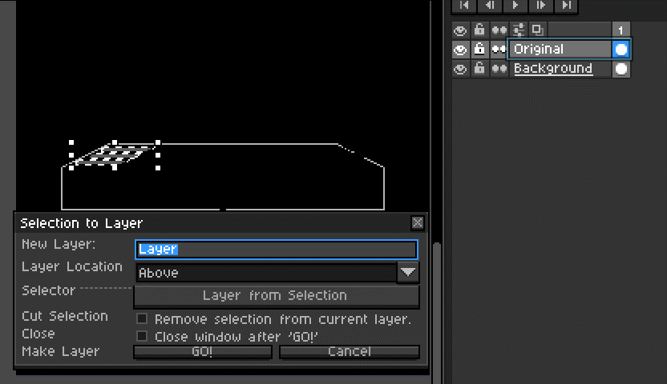

# Asepritely :art:

**Asepritely** is a library of helpful [Lua](https://lua.org) scripts and extensions I've written for use in the pixel art editor, [Aseprite](https://aseprite.org). 

> **UPDATE**: I've also started including some [**palettes**](#Extensions) that I use myself!

Beginning in Aseprite `1.2.10`, users were able to begin using Lua to write their own code extensions to assist in their spritely endeavors. I've written _many_ myself, but, they were originally just for my own use. I've seen that maybe one or two were worthy of sharing, so, as I clean up their code, I will add them to this repository for **you, the artist** to consume at their leisure.
The Scripts :memo:
------------

> As time goes on, I will add entries to this section to synopsize any new scripts, and their functionality.

#### Foreground RGB Toolbar :rainbow:

This script creates a little toolbar that enables you to quickly view the **RGB** values of your **current foreground color**. _Very helpful when getting color values for use in other software!_

---

#### Export PNG on Save

I made this [as a request from someone on the forums](https://community.aseprite.org/t/auto-export-option-when-saving-an-aseprite-file/8047/4)!

When run, this script simply _saves your current sprite_ and **saves a `.png` copy at the same time**! The file is output in the same directory you are working in. If you don't like the popup it gives when complete, open the script up in a text editor and set the value `POPUP` to `false`.

---

#### Save Selection to Layer

Aseprite already has a feature called "Save selection to new sprite". I often find that, while working on something, I need to **copy** or **cut** just a portion of a layer into a new one so I can divide things up more easily. 

This little beauty has been cleaned right up, and functions _much better than it did_. You can now select whether you want the selected content to be:

+ _Cut_ from the target layer.
+ _Copied_ from the target layer.
+ Placed _above_ the target layer.
+ Placed _below_ the target layer.
+ And whether to _close_ the window on execution.

Here's a little clip of it in action.

Palettes :gift: 
----------------------------------

I've added two palette files into an extension for anyone wanting to add to their palette collection!

They are the [Secret Pico-8](https://pico-8.fandom.com/wiki/User_blog:Iiviigames/Piccult_Colors!) palette, and the [Flat UI](https://flatuicolors.com/palette/defo) palette!

> Three Ways to get the palettes:

+ :arrow_forward: [Click here to download!](https://github.com/iiviigames/Asepritely/raw/master/extensions/iivii-palettes.aseprite-extension)

+ :arrow_forward: Clone this repo and then go into the `extensions` folder, where you'll find it. 

+ :arrow_forward: Click on the`extensions` folder up above, then click `iivii-palettes.aseprite-extension`, and click the button that says **Download**.

---

Here's a little gif showing how to import it into Aseprite!

Usage :orange_book:
------

To make use of these scripts, first clone the repo or [download the zip](https://github.com/iiviigames/Asepritely/archive/master.zip). 

Alternatively, you can [click here](https://github.com/iiviigames/Asepritely/raw/master/extensions/Asepritely.aseprite-extension) to download the `aseprite-extension` format of the scripts and palettes. 

> :notebook: `aseprite-extension`'s are actually just a zip file with a fancier name. :smiley:

Then, *open Aseprite, and peform the following*: 

**Option 1** _(zip)_: <kbd>File</kbd> `->` <kbd>Scripts</kbd> `->` <kbd>Open Scripts Folder</kbd>. Another explorer window should open up, and this is where you can **copy any of the scripts you want from the repo into the Aseprite scripts folder**!

**Option 2** _(extension)_: <kbd>Edit</kbd> `->` <kbd>Preferences</kbd> `->` <kbd>Extensions</kbd> and click <kbd>Add Extension</kbd>. Then, locate the `aseprite-extension` file you downloaded and hit _okay_.

Now that they're in the right place, in order to use them, you can either:

+ <kbd>File</kbd> `->` <kbd>Scripts</kbd> `->` <kbd>Rescan Scripts Folder</kbd> (**Faster, better option!**), _or..._
+ Restart Aseprite

The scripts will now be accesible by going back to the <kbd>File</kbd> `->` <kbd>Scripts</kbd> dropdown! 

> TIP: **You can even assign them to a keyboard shortcut through Aseprite's built-in keymap definition tool!**

### Setting Scripts to Keyboard Shortcuts

This is useful for some scripts, like `Export PNG on Save.lua`, and less useful for others. If you've never bound your scripts to keyboard shortcuts before, here's a quick how to. Open Aseprite and then:

+ Clicking <kbd>Edit</kbd> `->` <kbd>Keyboard Shortcuts</kbd>
+ In the window that opens, you'll be in the **Menu** section, and just toward the bottom, you'll see any and all scripts you have in your scripts folder listed.
+ Choose the one you want to assign a keyboard shortcut, and set it as you see fit!

> **EXAMPLE**: For `Export PNG on Save.lua`, _I recommend: <kbd>Ctrl</kbd> + <kbd>Alt</kbd> + <kbd>Shift</kbd> + <kbd>S</kbd>_

Other Useful Resources :see_no_evil:
------------------------

+ [Aseprite Scripting API](https://github.com/aseprite/api) 
   - _This is where you should start to begin writing your own Aseprite specific scripts! It has a lot of the information you need to start!_
+ [Aseprite Script Examples](https://github.com/aseprite/Aseprite-Script-Examples)
   - _A few scripts built by the devs themselves to give you a feel for what can be done with this API_.
+ [Programming in Lua](https://www.lua.org/pil/contents.html)
   - _The essential handbook for understanding the Lua language_.
+ [The Lua Tutorial](http://luatut.com/)
   - _Well designed, in-browser introduction to using Lua. Run code and learn all from within Firefox or Chrome!_

Thanks! :trophy:
---------

Feel free to [follow me on Twitter](https://twitter.com/odd_codes), [check out my website](https://odd.codes), or [see what else I've made](https://github.com/iiviigames)! Hope this serves to help you in some of your future endeavors!

_-_ **iivii**
:video_game:
