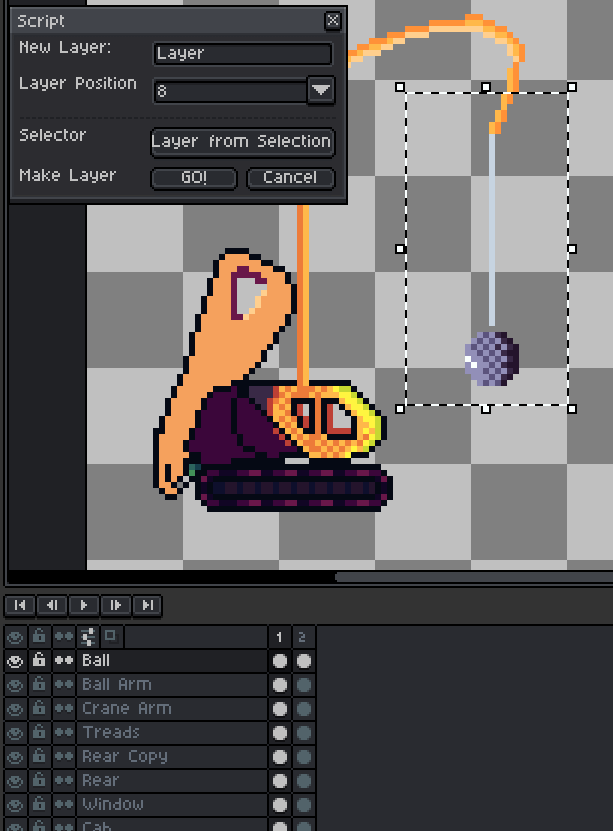

# Asepritely :art:


> **UPDATE**: 🎃 <datetime date="2022-10-06">October 06, 2022</datetime>  
> -   GBStudio palette added
> -  Interactive Cel Exporter

**Asepritely** is a library of helpful [Lua](https://lua.org) scripts and extensions I've written for use in the pixel art editor, [Aseprite](https://aseprite.org). 


Beginning in Aseprite `1.2.10`, users were able to begin using Lua to write their own code extensions to assist in their spritely endeavors. I've written _many_ myself, but, they were originally just for my own use. I've seen that maybe one or two were worthy of sharing, so, as I clean up their code, I will add them to this repository for **you, the artist** to consume at their leisure.

<details>
  <summary> 📓 <b>NOTE ON DOCS</b> </summary>
  <p>
    &nbsp;  &nbsp;&nbsp;&nbsp;&nbsp;&nbsp;&nbsp;&nbsp;
    <em>I will add entries to this section to synopsize any new scripts, and their functionality. </em>
  </p>
</details>

**TABLE OF CONTENTS** <a name="toc"></a>
---

> 💕 [Interactive Cel Exporter](#ice) 🔥 **NEW!!**  
> 🌈 [Foreground RGB Toolbar](#rgb)  
> 🙌 [Export PNG on Save](#epos)  
> ✂️ [Cut Selection to New Layer](#cut)  
> 🖱️ [Mousewheel Modifier Memo](#mmm)🔥 **NEW!!**   
> 🎮 [PICO-8 Spritesheet Template](#p8) 🔥 **NEW!!**  


## The Scripts :memo:

### 💕Interactive Cel Exporter  <a name="ice"></a> [⤴️](#toc)

If you've got a lot of cells in a single horiontal strip, say, from some kind of, oh I don't know, *spriter's resource* website, where there are many disparate images in a single long file, but you want to export certain ones quickly and efficientlly, without having to highlight anything, or scroll around through a massive timeline.

Old Vee has your number friend.

![c2i]


This was another request from someone that took me longer than I thought to make. Mostly because of time, but also because nearly all the functions inside this bad boy are not documented very well, or at all. That makes it the **perfect script to study** fo those who want to learn the Aseprite scripting language themselves.


---


### 🌈Foreground RGB Toolbar  <a name="rgb"></a> [⤴️](#toc)


This script creates a little toolbar that enables you to quickly view the **RGB** values of your **current foreground color**. _Very helpful when getting color values for use in other software!_

---

### 🙌 Export PNG on Save <a name="epos"></a> [⤴️](#toc)

I made this [as a request from someone on the forums](https://community.aseprite.org/t/auto-export-option-when-saving-an-aseprite-file/8047/4)!

When run, this script simply _saves your current sprite_ and **saves a `.png` copy at the same time**! The file is output in the same directory you are working in. If you don't like the popup it gives when complete, open the script up in a text editor and set the value `POPUP` to `false`.

---


### ✂️ Cut Selection to New Layer <a name="cut"></a> [⤴️](#toc)

Aseprite already has a feature called "Save selection to new sprite". I often find that, while working on something, I need to **copy** or **cut** just a portion of a layer into a new one so I can divide things up more easily. 

This little beauty has been cleaned right up, and functions _much better than it did_. You can now select whether you want the selected content to be:

+ _Cut_ from the target layer.
+ _Copied_ from the target layer.
+ Placed _above_ the target layer.
+ Placed _below_ the target layer.
+ And whether to _close_ the window on execution.

Here's a little clip of it in action.


And here's an older version of the same script.



---

### 🖱️ Middle Mousewheel Modifier Memo <a name="mmm"></a>  [⤴️](#toc)

This is simultaneously the most basic script in the collection, yet somehow the one that requires the most alteration from the user to make it work for their own needs.

See, Aseprite allows you to assign <kbd>CUSTOM KEY MODIFIERS</kbd> which alter the action you perform when you roll that middle mouse wheel. And while the default options are *fine*, I am a customizer, and you probably are too, seeing as you're reading this at all!

So, here's what mine looks like:

![mwm]

Because I there are so many ways to customize these functions, I **simply can't remember them**. So, this is just a little window to remind me.

So, for this to work for you, you need to open up the script, and see that there are two labeled tables in it:

1. Contains the **name of the action** (**Left Side**)
1. Contains the **keyboard shortcut** (**Right Side**)

What you need to do is simply add the appropriate labels in the **same position within the table**. For example:

```lua
-- Each group will be combined together in ascending numerical
-- order, so you have to make sure they are in the right table
-- positions, as the function that combines them will just be 
-- showing you incorrect shortcuts if you mess up!

action_names = {
  "Zoom In/Out",      -- action_shortcuts[1] Matches "Wheel" 
  "Scroll Layers",    -- action_shortcuts[2] Matches "Alt+Shift+Wheel"
}

action_shortcuts = {
  "Wheel",           -- action_names[1] 
  "Alt+Shift+Wheel", -- action_names[2]
}

```

This is a work in progress still. I want to programatically have the script read the `aseprite-keys` file that Aseprite produces. I just needed something quick, and this was good enough for me! Maybe it will be useful for you as well.

---

### 🎮 PICO-8 Spritesheet Template <a name="p8"></a> [⤴️](#toc)


The [PICO-8 fantasy coonsole](https://lexaloffle.com/pico-8.php) is one particular partner when it comes to working on things outside of its native environment. All colors **must be** within the 16 color palette (but, there's really 16 secret colors 🙊).  The spritesheet HAS TO  BE `128 x 128` pixels square, and it will not allow you to import those spritesheets unless you follow these rules.

![p8t8]

PICO-8 is fantastic, but I love working in aseprite, so, I got tired of spending 5 minutes setting up the basic file every time I wanted to work on some pixel art.

This is the solution. By assigning this to a keyboard shortcut, or selecting it from the menu, the script will make you the perfectly importable PICO-8 spritesheet file, with a background layer below that is locked, and a sprite layer above for your artistic endeavors.

It also automaticallly loads the **_Secret Pico_** Palette that I myself created, and included in this extension! Simply double click that extension file, and 💥, it just works.

---

# 🎁 Palettes  <a name="Extensions"></a>


I've added a few palettes into  the Asepritely extension, and as a standalone extension with just them in it, for anyone wanting to add to their palette collection!

- [Secret Pico-8](https://pico-8.fandom.com/wiki/User_blog:Iiviigames/Piccult_Colors!) palette!
- [Flat UI](https://flatuicolors.com/palette/defo) palette!
- [GB Studio](https://www.gbstudio.dev/docs/assets/sprites#image-requirements) palette!


> Three Ways to get the palettes:

+ ▶️ [Click here to download!](https://github.com/iiviigames/Asepritely/raw/master/extensions/iivii-palettes.aseprite-extension)

+ ▶️ Clone this repo and then go into the `extensions` folder, where you'll find it. 

+ ▶️ Click on the`extensions` folder up above, then click `iivii-palettes.aseprite-extension`, and click the button that says **Download**.


The easiest way to import them into Aseprite, is simply to:
> <kbd>DOUBLE CLICK</kbd> ON THE `.aseprite-extension` FILE!

But,,tere's a little gif showing another way to import them into Aseprite! (_Mostly left here for legacy purposes._)


# 📙 Usage 


To make use of these scripts, first clone the repo or [download the zip](https://github.com/iiviigames/Asepritely/archive/master.zip). 

Alternatively, you can [click here](https://github.com/iiviigames/Asepritely/raw/master/extensions/Asepritely.aseprite-extension) to download the `aseprite-extension` format of the scripts and palettes. 

> 🎵  `aseprite-extension`'s are actually just a zip file with a fancier name. 😄

## METHOD 1️⃣ 

❗❗❗❗❗❗❗❗❗❗❗❗❗❗❗❗❗❗❗❗❗❗❗❗

**JUST DOUBLE CLICK ON THE `.aseprite-extension` FILE, AND IT WORKS!**

❗❗❗❗❗❗❗❗❗❗❗❗❗❗❗❗❗❗❗❗❗❗❗❗


## METHOD 2️⃣ (*Only use this if method 1️⃣ fails*)

Then, *open Aseprite, and peform the following*: 

**Option 1** _(zip)_: <kbd>File</kbd> `->` <kbd>Scripts</kbd> `->` <kbd>Open Scripts Folder</kbd>. Another explorer window should open up, and this is where you can **copy any of the scripts you want from the repo into the Aseprite scripts folder**!

**Option 2** _(extension)_: <kbd>Edit</kbd> `->` <kbd>Preferences</kbd> `->` <kbd>Extensions</kbd> and click <kbd>Add Extension</kbd>. Then, locate the `aseprite-extension` file you downloaded and hit _okay_.

Now that they're in the right place, in order to use them, you can either:


+ <kbd>File</kbd> `->` <kbd>Scripts</kbd> `->` <kbd>Rescan Scripts Folder</kbd> (**Faster, better option!**), _or..._
+ Restart Aseprite

The scripts will now be accesible by going back to the <kbd>File</kbd> `->` <kbd>Scripts</kbd> dropdown! 

> TIP: **You can even assign them to a keyboard shortcut through Aseprite's built-in keymap definition tool!**


## ⌨️ Setting Scripts to Keyboard Shortcuts

This is useful for some scripts, like `Export PNG on Save.lua`, and less useful for others. If you've never bound your scripts to keyboard shortcuts before, here's a quick how to. Open Aseprite and then:

+ Clicking <kbd>Edit</kbd> `->` <kbd>Keyboard Shortcuts</kbd>
+ In the window that opens, you'll be in the **Menu** section, and just toward the bottom, you'll see any and all scripts you have in your scripts folder listed.
+ Choose the one you want to assign a keyboard shortcut, and set it as you see fit!

> **EXAMPLE**: For `Export PNG on Save.lua`, _I recommend: <kbd>Ctrl</kbd> + <kbd>Alt</kbd> + <kbd>Shift</kbd> + <kbd>S</kbd>_


⚡ Other Useful Resources 
====================================

+ [Aseprite Scripting API](https://github.com/aseprite/api) 
   - _This is where you should start to begin writing your own Aseprite specific scripts! It has a lot of the information you need to start!_
+ [Aseprite Script Examples](https://github.com/aseprite/Aseprite-Script-Examples)
   - _A few scripts built by the devs themselves to give you a feel for what can be done with this API_.
+ [Programming in Lua](https://www.lua.org/pil/contents.html)
   - _The essential handbook for understanding the Lua language_.
+ [The Lua Tutorial](http://luatut.com/)
   - _Well designed, in-browser introduction to using Lua. Run code and learn all from within Firefox or Chrome!_


🏆 Thanks!
---------

Feel free to [follow me on Twitter](https://twitter.com/odd_codes), [check out my website](https://odd.codes), or [see what else I've made](https://github.com/iiviigames)! Hope this serves to help you in some of your future endeavors!

If any of this has helped you, please consider [donating on my Patreon](https://patreon.com/iiviigames), or simply [purchasing it for a few dollars on itch.io](https://iivii.itch.io/asepritely)

_-_ **iivii**
🎲


<!-- ----------------------------------------------- -->

[#]: # "IMAGES "

[p8t8]: <./img/p8t8fin.gif> "The 1 Click PICO-8 Spritesheet Maker"
[c2i]: <./img/c2i.gif> "Export Range of Cells to Individual Images"
[mwm]: <./img/mwcuts.gif> "Middle Mouse Modifer Memo Window"
