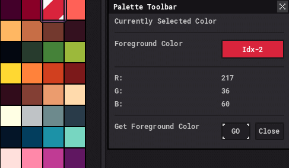
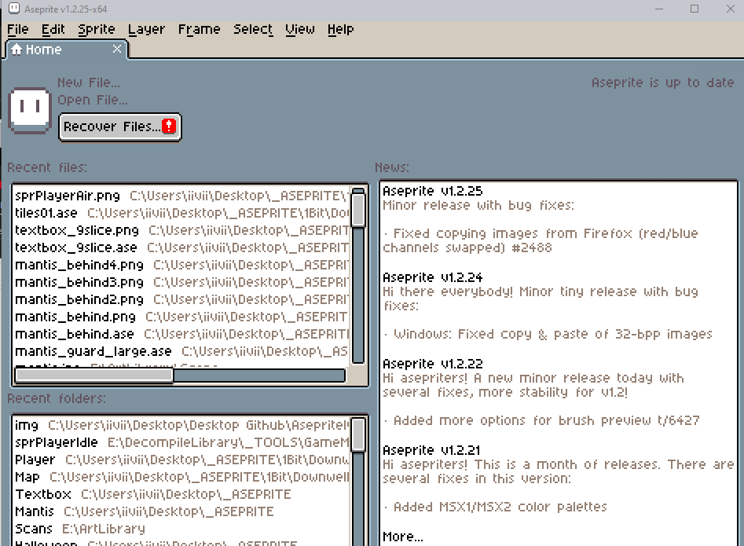

# Asepritely :art:

**Asepritely** is a library of helpful [Lua](https://lua.org) scripts and extensions I've written for use in the pixel art editor, [Aseprite](https://aseprite.org). 

> **UPDATE**: I've also started including some [**palettes**](#Extensions) that I use myself!

Beginning in Aseprite `1.2.10`, users were able to begin using Lua to write their own code extensions to assist in their spritely endeavors. I've written _many_ myself, but, they were originally just for my own use. I've seen that maybe one or two were worthy of sharing, so, as I clean up their code, I will add them to this repository for **you, the artist** to consume at their leisure.

Usage :orange_book:
------

To make use of these scripts, first clone the repo or [download the zip](https://github.com/iiviigames/Asepritely/archive/master.zip). Open this folder in an explorer window. Then, *open Aseprite, and peform the following*: <kbd>File</kbd> `->` <kbd>Scripts</kbd> `->` <kbd>Open Scripts Folder</kbd>. Another explorer window should open up, and this is where you can **copy any of the scripts you want from the repo into the Aseprite scripts folder**!

Now that they're in the right place, in order to use them, you can either:

+ Restart Aseprite, _or_,
+ <kbd>File</kbd> `->` <kbd>Scripts</kbd> `->` <kbd>Rescan Scripts Folder</kbd> (**Faster, better option!**)

The scripts will now be accesible by going back to the <kbd>File</kbd> `->` <kbd>Scripts</kbd> dropdown! 

> TIP: **You can even assign them to a keyboard shortcut through Aseprite's built-in keymap definition tool!**

The Scripts :memo:
------------

> As time goes on, I will add entries to this section to synopsize any new scripts, and their functionality.

#### Foreground RGB Toolbar :rainbow:

This script creates a little toolbar that enables you to quickly view the **RGB** values of your **current foreground color**. _Very helpful when getting color values for use in other software!_

Palettes :gift: 
----------------------------------

I've added two palette files into an extension for anyone wanting to add to their palette collection!

They are the [Secret Pico-8](https://pico-8.fandom.com/wiki/User_blog:Iiviigames/Piccult_Colors!) palette, and the [Flat UI](https://flatuicolors.com/palette/defo) palette!

> Three Ways to get the palettes:

+ :arrow_forward: [Click here to download!](https://github.com/iiviigames/Asepritely/raw/master/extensions/iivii-palettes.aseprite-extension)

+ :arrow_forward: Clone this repo and then go into the `extensions` folder, where you'll find it. 

+ :arrow_forward: Click on the`extensions` folder up above, then click `iivii-palettes.aseprite-extension`, and click the button that says **Download**.

---

Here's a little gif showing how to import it into Aseprite!

Other Useful Resources :see_no_evil:
------------------------

+ [Aseprite Scripting API](https://github.com/aseprite/api) 
   - _This is where you should start to begin writing your own Aseprite specific scripts! It has a lot of the information you need to start!_
+ [Aseprite Script Examples](https://github.com/aseprite/Aseprite-Script-Examples)
   - _A few scripts built by the devs themselves to give you a feel for what can be done with this API_.
+ [Programming in Lua](https://www.lua.org/pil/contents.html)
   - _The essential handbook for understanding the Lua language_.
+ [The Lua Tutorial](http://luatut.com/)
   - _Well designed, in-browser introduction to using Lua. Run code and learn all from within Firefox or Chrome!_

Thanks! :trophy:
---------

Feel free to [follow me on Twitter](https://twitter.com/odd_codes), [check out my website](https://odd.codes), or [see what else I've made](https://github.com/iiviigames)! Hope this serves to help you in some of your future endeavors!

_-_ **iivii**
:video_game:
